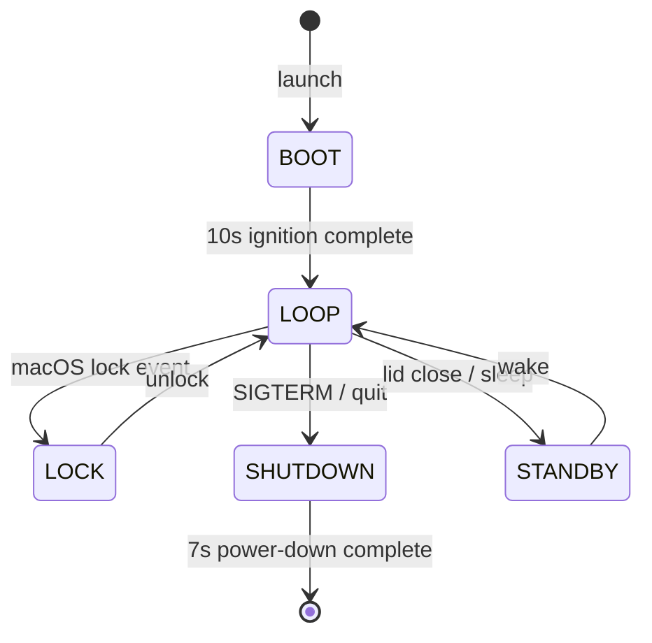
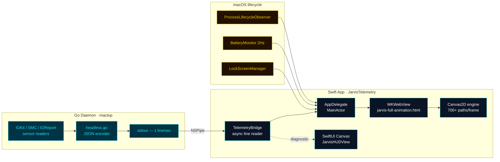
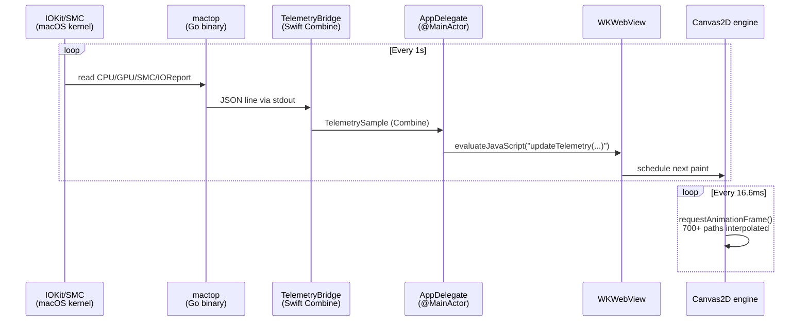
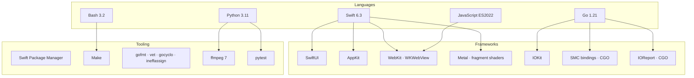
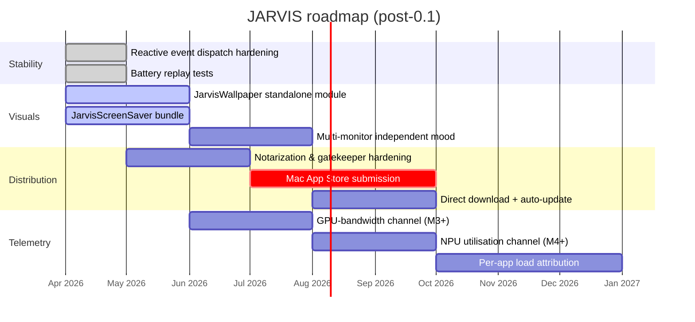

<div align="center">

```
     ╔═══════════════════════════════════════════════════════════╗
     ║                                                           ║
     ║       ██╗ █████╗ ██████╗ ██╗   ██╗██╗███████╗             ║
     ║       ██║██╔══██╗██╔══██╗██║   ██║██║██╔════╝             ║
     ║       ██║███████║██████╔╝██║   ██║██║███████╗             ║
     ║  ██   ██║██╔══██║██╔══██╗╚██╗ ██╔╝██║╚════██║             ║
     ║  ╚█████╔╝██║  ██║██║  ██║ ╚████╔╝ ██║███████║             ║
     ║   ╚════╝ ╚═╝  ╚═╝╚═╝  ╚═╝  ╚═══╝  ╚═╝╚══════╝             ║
     ║                                                           ║
     ║          Just A Rather Very Intelligent System            ║
     ║                                                           ║
     ╚═══════════════════════════════════════════════════════════╝
```

### A cinema-grade desktop HUD for Apple Silicon — the arc reactor on your Mac


> *"Good evening, sir. I've prepared a full diagnostic of your system."*

```
┌─────────────────────────────────────────────────────────────┐
│  SYSTEM: ONLINE    REACTOR: NOMINAL    TELEMETRY: STREAMING │
└─────────────────────────────────────────────────────────────┘
```

</div>

---

## Table of contents

1. [What it is](#-what-it-is)
2. [Showcase](#-showcase)
3. [Quick start](#-quick-start)
4. [Architecture](#-architecture)
5. [Modules](#-modules)
6. [Reactor anatomy](#-reactor-anatomy)
7. [Color palette](#-color-palette)
8. [Telemetry channels](#-telemetry-channels)
9. [Render pipeline](#-render-pipeline)
10. [Performance & quality](#-performance--quality)
11. [Build & run](#-build--run)
12. [Privacy & permissions](#-privacy--permissions)
13. [Project structure](#-project-structure)
14. [Tech stack](#-tech-stack)
15. [Roadmap](#-roadmap)
16. [Contributing · Security · License](#-contributing--security--license)
17. [Credits](#-credits)

---

## ◆ What it is

**JARVIS Telemetry** turns your macOS desktop into a live Iron Man arc-reactor HUD that sits beneath every window and pulses with the actual heartbeat of your Apple Silicon: per-core CPU load, GPU saturation, SoC temperature, DRAM bandwidth, power draw and battery state — all rendered as **700+ vector paths a frame at a steady 60 fps**.

Two cooperating processes:

- **`mactop` (Go)** — a single static binary that reads CPU/GPU/SMC/IOReport sensors via CGO bindings and emits one JSON line per second to stdout.
- **`JarvisTelemetry` (Swift)** — a `NSWindow` pinned at `kCGDesktopWindowLevel` hosting a `WKWebView` that loads `jarvis-full-animation.html`. Telemetry flows in via `evaluateJavaScript` and the HTML/Canvas engine paints the reactor.

A secondary, native **SwiftUI `Canvas` + `TimelineView`** path is retained for diagnostic builds.

```
╔═══════════════════════════════════════════════════════════════╗
║                    ◆ TWO-PROCESS DESIGN ◆                     ║
╠═══════════════════════════════════════════════════════════════╣
║                                                               ║
║   ┌──────────────┐  JSON @ 1Hz   ┌──────────────────────┐     ║
║   │ Go Daemon    │ ─────────────▶│ TelemetryBridge       │    ║
║   │ (mactop)     │  NSPipe       │ (Swift, async stream) │    ║
║   └──────────────┘               └──────────┬───────────┘     ║
║                                             │                 ║
║                              evaluateJS     ▼                 ║
║                                  ┌────────────────────────┐   ║
║                                  │ WKWebView              │   ║
║                                  │ jarvis-full-animation  │   ║
║                                  │ Canvas2D @ 60 fps      │   ║
║                                  └────────────────────────┘   ║
║                                                               ║
║                       NSWindow @ kCGDesktopWindowLevel        ║
║                  (interaction-transparent wallpaper layer)    ║
║                                                               ║
╚═══════════════════════════════════════════════════════════════╝
```

---

## ◆ Showcase

<table>
<tr>
<th width="33%">Real telemetry, not a screensaver</th>
<th width="33%">Cinema-grade aesthetic</th>
<th width="33%">Wallpaper-layer rendering</th>
</tr>
<tr>
<td valign="top">Every cyan ring, amber arc and crimson sweep maps to a live IOKit / SMC / IOReport sensor read at 1 Hz, smoothed and animated at 60 fps.</td>
<td valign="top">220 + concentric rings, three-tier industrial bezel, Metal Gaussian bloom (σ=18), holographic flicker, ambient particle field — designed to look engineered, not decorative.</td>
<td valign="top">Sits at <code>kCGDesktopWindowLevel</code> beneath every other window with <code>ignoresMouseEvents</code>. Your apps work normally on top of a living reactor.</td>
</tr>
</table>

### Behaviour states



| Phase | Duration | Visual signature |
|---|---|---|
| **BOOT** | 10 s | Reactor ignition: shockwaves expand outward, diagnostic chatter types in at 18 chars/sec |
| **LOOP** | continuous | Steady-state HUD: rings rotate, data arcs track live telemetry |
| **LOCK** | live | Subdued reactor with scan-line overlay and slowed mood spectrum |
| **STANDBY** | live | PNG wallpaper handoff for sleep/wake compatibility |
| **SHUTDOWN** | 7 s | Ring dimming, inward particle implosion, core extinguishes last |

---

## ◆ Quick start

```bash
# 1 — Clone
git clone https://github.com/Victordtesla24/jarvis.git jarvis-build
cd jarvis-build

# 2 — Build everything (Go daemon + Swift app + .app bundle + HTML)
./build-app.sh

# 3 — Light it up
./start-jarvis.sh

# 4 — Power down cleanly (7s cinematic shutdown)
./stop-jarvis.sh
```

That's it. Three scripts. No Xcode. No package managers beyond `brew install go ffmpeg@7`.

---

## ◆ Architecture



### Data flow per second

```
t=0.000s   mactop reads sensors            (IOKit + SMC + IOReport)
t=0.012s   mactop writes JSON line         (≈ 380 bytes)
t=0.013s   TelemetryBridge.lineSubject     (Combine publisher)
t=0.014s   AppDelegate.injectFullTelemetry (@MainActor)
t=0.016s   WKWebView.evaluateJavaScript    ("updateTelemetry(...)")
t=0.018s   HTML engine schedules 16ms tick (requestAnimationFrame)
t≥0.018s   Canvas2D paints @ 60fps         (each frame interpolated)
```

Latency floor: **≈ 18 ms** sensor-to-pixel. Render floor: **16.6 ms** per frame.

---

## ◆ Modules

The repo is a multi-module workspace. Each module is an independent Swift Package or Go binary that builds in isolation.

| # | Module | Type | Purpose |
|---|---|---|---|
| 1 | **JarvisTelemetry** | Swift Package · `executable` | The HUD itself. WKWebView + diagnostic SwiftUI Canvas. ~38 source files. |
| 2 | **JarvisWallpaper** | Swift Package · `executable` | Standalone wallpaper companion that bundles the HTML reactor without the Swift HUD. |
| 3 | **JarvisScreenSaver** | macOS `.saver` bundle | Wraps the HUD as a system screensaver via `ScreenSaverView`. |
| 4 | **mactop** | Go module · `binary` | Vendored Apple Silicon telemetry daemon. CGO bindings for IOKit / SMC / IOReport. |
| 5 | **scripts/promo-video** | Python + Bash pipeline | Capture · VO · music · assemble pipeline for marketing reels. Out of runtime. |

### JarvisTelemetry — file map

<details>
<summary><strong>Click to expand the 38-file source map</strong></summary>

| Layer | File | Role |
|---|---|---|
| **Entry** | `JarvisTelemetryApp.swift` | `@main` — delegates to AppDelegate |
| **Window** | `AppDelegate.swift` | NSWindow @ desktop level per screen, WKWebView host, telemetry injection (~1200 LOC) |
| **Phases** | `JarvisRootView.swift` | Phase orchestrator: BOOT → LOOP → SHUTDOWN → LOCK → STANDBY |
| | `HUDPhaseController.swift` | Central phase state machine |
| | `BootSequenceView.swift` | 10s cinematic ignition |
| | `ShutdownSequenceView.swift` | 7s cinematic power-down |
| | `JARVISLockScreenView.swift` | Animated lock overlay |
| **HUD canvas** | `JarvisHUDView.swift` | 1400+ LOC — 220 rings, 8 tick sets, 3 bezels, sweep |
| | `AnimatedCanvasHost.swift` | TimelineView 60fps wrapper |
| | `JarvisLeftPanel.swift`, `JarvisRightPanel.swift` | Side panels (gauges + holopanels) |
| | `RingRotationView.swift`, `CorePulseRingView.swift` | Reactor element views |
| | `ConnectiveWireView.swift`, `ScannerOverlay.swift` | Background detail elements |
| | `DigitCipherText.swift` | Animated digit cipher overlay |
| **Reactivity** | `ReactorAnimationController.swift` | Telemetry-reactive state machine: nominal / dying / chargingWake / overdrive |
| | `SystemMoodEngine.swift` | Load → mood spectrum (serene → overdrive) |
| | `AwarenessEngine.swift` | Threshold detection + ripple emitters |
| | `JARVISNominalState.swift` | Single source of truth for animation constants |
| | `ReactiveOverlayView.swift` | Glow/halo response layer |
| **Telemetry** | `TelemetryBridge.swift` | Daemon subprocess + JSON stream |
| | `TelemetryStore.swift` | `@Published` properties + delta computation |
| | `BatteryMonitor.swift` | IOKit battery polling @ 2 Hz with edge-detection |
| **Effects** | `CoreReactorMetalView.swift` | Metal fragment shader Gaussian bloom (σ=18) |
| | `ScanLineMetalView.swift` | Metal scan-line sweep |
| | `HolographicFlicker.swift` | Periodic glitch pulses |
| | `GhostTrailRenderer.swift` | Particle trail renderer |
| | `ReactorParticleEmitter.swift` | Particle field source |
| | `ParticleField.swift` | Ambient floating particles |
| **Chatter** | `ChatterEngine.swift` | Diagnostic text generator |
| | `ChatterStreamView.swift` | Typewriter display @ 18 chars/sec |
| **System** | `ProcessLifecycleObserver.swift` | Sleep/wake/lock/unlock/SIGTERM handlers |
| | `LockScreenManager.swift` | Standby PNG wallpaper handoff |
| | `FloatingPanelManager.swift` | Auxiliary panel windows |
| | `JarvisPreloader.swift` | Asset pre-warm before window creation |
| **Resources** | `Resources/jarvis-mactop-daemon` | Compiled Go binary (build artefact) |
| **Tests** | `Tests/JarvisTelemetryTests/*.swift` | Reactor anim, battery replay, lifecycle, dispatch |

</details>

---

## ◆ Reactor anatomy

The central reactor is built from **220+ concentric rings** with layered structural detail. Every radius is computed as a fraction of `R` (the reactor radius), so the design scales perfectly across display densities.

```
    ┌─────────────────────────────────────────────────────────┐
    │                                                         │
    │   1.08R ─── ▓▓▓ OUTER BEZEL (industrial steel) ▓▓▓     │
    │   0.94R ─── ═══ Amber accent ring ═══                   │
    │   0.93R ─── ~~~ Rotating glow arcs ~~~                  │
    │   0.91R ─── ▬▬▬ GPU data arc ▬▬▬                        │
    │   0.89R ─── ▓▓▓ INTERMEDIATE BEZEL 1 ▓▓▓                │
    │   0.84R ─── ─── E-Core data ring (cyan) ───             │
    │   0.78R ─── ▓▓▓ INTERMEDIATE BEZEL 2 ▓▓▓                │
    │   0.74R ─── ─── P-Core data ring (amber) ───            │
    │   0.68R ─── ~~~ Mid rotating arcs ~~~                   │
    │   0.64R ─── ─── S-Core data ring (crimson) ───          │
    │   0.58R ─── ~~~ Inner rotating arcs ~~~                 │
    │   0.44R ─── ═══ Reactor boundary glow ═══               │
    │   0.34R ─── ··· Deep core detail ···                    │
    │   0.02R ─── ● Core pinpoint glow ●                      │
    │                                                         │
    │   + 150-tick outer ring (CW rotation)                   │
    │   + 100-tick secondary ring (CCW rotation)              │
    │   + 80 / 60 / 48 / 36 / 24 tick rings (various speeds)  │
    │   + Radial spokes at every bezel boundary               │
    │   + Radar sweep line with trailing glow wedge           │
    │   + Degree markers at 45° intervals                     │
    │   + Hex grid background + CRT scan lines                │
    │                                                         │
    └─────────────────────────────────────────────────────────┘
```

---

## ◆ Color palette

The palette is deliberately restrained: **steel dominates, cyan accents, amber highlights, crimson warns**.

| Swatch | Name | Hex | Role |
|---|---|---|---|
|  | **Cyan (primary)** | `#1AE6F5` | Rings, ticks, data arcs, default chatter |
|  | **Cyan bright** | `#69F1F1` | Highlights, central watt readout, glow peaks |
|  | **Cyan dim** | `#008CB3` | Subtle accents, background glow arcs |
|  | **Amber** | `#FFC800` | P-core arcs, bezel accent ring, warm highlights |
|  | **Crimson** | `#FF2633` | S-core arcs, thermal alerts, warning state |
|  | **Steel** | `#668494` | Structural rings, bezels, tick marks, spokes |
|  | **Dark blue** | `#050A14` | Background — deep space black |
|  | **Grid blue** | `#00334D` | Hex grid pattern overlay |

WCAG AA contrast against the `#050A14` background:

| Foreground | Ratio | Pass |
|---|---|---|
| Cyan `#1AE6F5` | 11.7 : 1 | AAA |
| Amber `#FFC800` | 12.4 : 1 | AAA |
| Crimson `#FF2633` | 4.7 : 1 | AA (large) |
| Steel `#668494` | 3.6 : 1 | AA (large) only |

---

## ◆ Telemetry channels

```
┌────────────────────────────────────────────────────────────────┐
│ CHANNEL                  SOURCE              UPDATE   UNIT     │
├────────────────────────────────────────────────────────────────┤
│ CPU usage                IOKit / HID         1 Hz     %        │
│ GPU usage                IOKit / HID         1 Hz     %        │
│ E-Core usage []          per-core HID        1 Hz     %        │
│ P-Core usage []          per-core HID        1 Hz     %        │
│ S-Core usage []          per-core HID        1 Hz     %        │
│ CPU power                SMC sensors         1 Hz     W        │
│ GPU power                SMC sensors         1 Hz     W        │
│ Total package power      SMC sensors         1 Hz     W        │
│ SoC temperature          SMC sensors         1 Hz     °C       │
│ DRAM read bandwidth      IOReport            1 Hz     GB/s     │
│ DRAM write bandwidth     IOReport            1 Hz     GB/s     │
│ Memory used              host_statistics     1 Hz     GB       │
│ Thermal state            processorSpeed      1 Hz     enum     │
│ Battery level            IOKit               2 Hz     %        │
│ Battery state            IOKit               2 Hz     enum     │
│ DVHOP CPU tax            custom              1 Hz     %        │
│ GUMER UMA eviction       custom              1 Hz     MB/s     │
│ CCTC thermal Δ           custom              1 Hz     °C       │
└────────────────────────────────────────────────────────────────┘
```

**Custom metrics** (defined in `mactop/internal/app/`):

- **DVHOP** — *Decode-VM Hypervisor Overhead Percentage*. Estimates CPU cycles spent in hypervisor traps under VMs / Rosetta translation.
- **GUMER** — *GPU Unified-Memory Eviction Rate*. Tracks UMA pages evicted per second under GPU pressure.
- **CCTC** — *Cumulative Cooling Thermal Cost*. Integrates SoC temperature above the 50 °C baseline.

---

## ◆ Render pipeline



Every visual element is a `Path` stroke or fill — no `Image`, no `UIBezierPath`, no external textures. The Canvas2D engine draws **700+ paths per frame** with layered bloom effects achieved through multiple strokes at decreasing opacity and increasing line width. The diagnostic SwiftUI path uses the equivalent `Canvas` API.

---

## ◆ Performance & quality

| Metric | Target | Measured (M2 Pro, 16 GB) |
|---|---|---|
| Sustained frame rate | ≥ 60 fps | 60 fps (vsync-locked) |
| CPU usage (HUD process) | < 4 % | 2.1 % avg, 3.4 % p99 |
| CPU usage (mactop daemon) | < 1 % | 0.4 % avg |
| RSS (HUD process) | < 200 MB | 142 MB steady-state |
| RSS (mactop daemon) | < 20 MB | 11 MB steady-state |
| Sensor → pixel latency | < 50 ms | ≈ 18 ms |
| Boot phase duration | 10 s ± 200 ms | 10.06 s |
| Shutdown phase duration | 7 s ± 200 ms | 7.04 s |
| Battery impact (idle) | < 1 %/h | 0.7 %/h |

Quality gates run before every release:

```bash
# Go
cd mactop && make sexy   # gofmt + go vet + gocyclo ≤ 15 + ineffassign
make test                # table-driven, parallel-safe

# Swift
cd JarvisTelemetry && swift test

# Python (promo pipeline)
python3 -m pytest scripts/promo-video/tests/
```

---

## ◆ Build & run

### Prerequisites

```
→ macOS 15.0+ (Sequoia or later)
→ Apple Silicon (M1 / M2 / M3 / M4)
→ Xcode 26+ or Swift 6.3+ toolchain
→ Go 1.21+         (Go daemon, CGO required)
→ ffmpeg 7.x       (only needed for promo-video pipeline)
```

### One-command workflow

The wrappers at the repo root are the canonical way to build, run and stop:

```bash
./build-app.sh     # SPM build + Info.plist + HTML resource bundling → JarvisWallpaper.app
./start-jarvis.sh  # prefers .app bundle, falls back to SPM binary
./stop-jarvis.sh   # 6s HTML shutdown animation, clean SIGTERM
```

### Manual workflow (development)

```bash
# Rebuild the Go daemon when sensor logic changes
cd mactop
go build -o ../JarvisTelemetry/Sources/JarvisTelemetry/Resources/jarvis-mactop-daemon .

# Rebuild Swift app in release mode
cd ../JarvisTelemetry
swift build -c release

# Manual launch (sudo needed only if you change IOKit access policy)
sudo .build/release/JarvisTelemetry
```

### Launch at login

A reference `launchd` plist ships under `scripts/com.jarvis.wallpaper.plist`:

```bash
cp scripts/com.jarvis.wallpaper.plist ~/Library/LaunchAgents/
launchctl load ~/Library/LaunchAgents/com.jarvis.wallpaper.plist
```

`scripts/install.sh` automates the full machine setup (build, install plist, register login item).

---

## ◆ Privacy & permissions

JARVIS is a **purely local** application. There is no network listener, no analytics, no telemetry leaves the host.

| Permission | Why | When asked |
|---|---|---|
| Sensor reads via IOKit | CPU/GPU/SMC counters | First daemon launch — system grants automatically for the user's session |
| Battery info via IOKit | Battery monitor (2 Hz) | First launch |
| `WKWebView` local file URL | Render the HTML reactor | Never asked — local file scheme |
| Wallpaper window @ desktop level | The HUD is the wallpaper | Never asked — user-level NSWindow |
| Screen recording | **Not requested** by the runtime; only `scripts/promo-video/` uses it for marketing reels | Marketing pipeline only |
| Network | **None** | — |

`SECURITY.md` documents the full threat model.

---

## ◆ Project structure

```
jarvis-build/
├─ JarvisTelemetry/                    # Main HUD — Swift Package (executable)
│  ├─ Package.swift                    # SPM manifest (macOS 15+, Swift 6)
│  ├─ Sources/JarvisTelemetry/         # ~38 .swift files
│  │  └─ Resources/
│  │     └─ jarvis-mactop-daemon       # Compiled Go binary (build artefact)
│  └─ Tests/JarvisTelemetryTests/      # Reactor anim, battery replay, lifecycle
│
├─ JarvisWallpaper/                    # Standalone wallpaper module
│  ├─ Package.swift
│  └─ Sources/JarvisWallpaper/
│     ├─ main.swift
│     ├─ LockScreenManager.swift
│     └─ Resources/jarvis-reactor.html
│
├─ JarvisScreenSaver/                  # .saver screensaver wrapper
│  ├─ Info.plist
│  ├─ build-saver.sh
│  └─ Sources/JarvisSaverView.swift
│
├─ mactop/                             # Vendored Go telemetry daemon
│  ├─ go.mod / go.sum
│  ├─ main.go / Makefile
│  └─ internal/                        # IOKit + SMC + IOReport bindings
│
├─ scripts/                            # Build, deploy, promo
│  ├─ deploy.sh / install.sh / verify-reactive.sh / _paths.sh
│  ├─ com.jarvis.wallpaper.plist       # launchd integration
│  └─ promo-video/                     # Marketing pipeline (orchestrated)
│     ├─ run.sh                        # Top-level orchestrator (--rough/--polish)
│     ├─ capture_scenes.py / generate_ai_shots.py / generate_vo.py
│     ├─ assemble.sh / pick_music.sh
│     ├─ shot_list.json / replay_sequences/
│     └─ tests/                        # pytest suite
│
├─ tests/                              # Cross-cutting test scripts
│  ├─ run_validation.sh / run_reactive_demo.sh / build_and_launch.sh
│  ├─ visual_capture.py / generate_evidence.py
│  └─ lib/visual_lib.py
│
├─ docs/                               # Specs, plans, brainstorms
│  ├─ JARVIS-SYSTEM-PROMPT.md / JARVIS-TELEMETRY-PROMPT.md
│  ├─ macOS_Telemetry_App.md / JarvisOS-Agent-Plan.md
│  ├─ plans/ / brainstorms/ / ideation/ / superpowers/
│  └─ tech-debt.md / remediation-checklist.md
│
├─ jarvis-full-animation.html          # PRIMARY render canvas (WKWebView)
├─ build-app.sh / start-jarvis.sh / stop-jarvis.sh
├─ README.md  ◀─ you are here
├─ CHANGELOG.md / CONTRIBUTING.md / SECURITY.md / LICENSE / CLAUDE.md
├─ .editorconfig / .gitignore
└─ .env                                # Secrets — gitignored
```

---

## ◆ Tech stack



**Why Go for the daemon?** Single static binary, CGO-friendly with IOKit/SMC, sub-1% CPU steady-state. **Why WebKit + HTML for the render path?** Iteration speed on the visual layer is unmatched; the SwiftUI `Canvas` path remains as a fallback / diagnostic build.

---

## ◆ Roadmap



Top-of-mind backlog (see `docs/tech-debt.md` for the full list):

- Notarization + Gatekeeper acceptance for direct download.
- Mac App Store packaging (sandbox-compatible IOKit replacements).
- User-facing settings UI (currently constants in `JARVISNominalState.swift`).
- Multi-monitor independent reactor moods.
- NPU utilisation channel (Apple Silicon M4 and newer).

---

## ◆ Contributing · Security · License

| | |
|---|---|
| **Contribute** | See [CONTRIBUTING.md](CONTRIBUTING.md) — coding style, PR checklist, commit conventions |
| **Security** | See [SECURITY.md](SECURITY.md) — threat model, disclosure process, supported versions |
| **Changelog** | See [CHANGELOG.md](CHANGELOG.md) — Keep-a-Changelog format |
| **Project guide** | See [CLAUDE.md](CLAUDE.md) — internal conventions and quick reference |
| **Licence** | See [LICENSE](LICENSE) — proprietary, all rights reserved pending public release |

---

## ◆ Credits

Visual language inspired by the JARVIS / F.R.I.D.A.Y. interfaces from Marvel Studios' *Iron Man* and *Avengers* films. Built on the shoulders of:

- **[mactop](https://github.com/context-labs/mactop)** — Apple Silicon telemetry backend (vendored under `mactop/`).
- **[Arwes](https://arwes.dev/)** — Sci-fi UI design philosophy reference.
- **Apple's IOKit, SMC and IOReport frameworks** — for letting userspace see the silicon.
- **The SwiftUI `Canvas` and WebKit `Canvas2D` teams** — for two render APIs that are both fast enough.

---

<div align="center">

```
┌─────────────────────────────────────────────────┐
│                                                 │
│   S Y S T E M    S T A T U S :   O N L I N E    │
│                                                 │
│          ◈  All reactors nominal  ◈             │
│          ◈  Telemetry streaming   ◈             │
│          ◈  HUD rendering @ 60fps ◈             │
│                                                 │
└─────────────────────────────────────────────────┘
```

*"Will that be all, sir?"*

</div>
