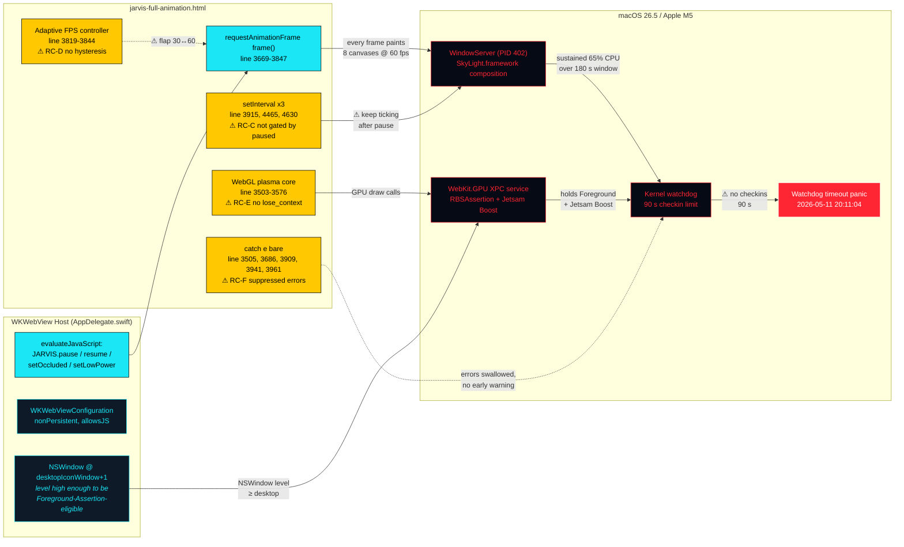

<div align="center">

```
╔══════════════════════════════════════════════════════════════════════════╗
║                                                                          ║
║     ░░░██╗░█████╗░██████╗░██╗░░██╗░░░░██╗░██████╗██████╗░░█████╗░       ║
║     ░░░██║██╔══██╗██╔══██╗██║░░██║░░░░██║██╔════╝██╔══██╗██╔══██╗       ║
║     ░░░██║███████║██████╔╝╚█████╔╝░░░░██║╚█████╗░██████╔╝███████║       ║
║     ██╗██║██╔══██║██╔══██╗░╚═══██╗░░░░██║░╚═══██╗██╔══██╗██╔══██║       ║
║     ╚█████╔╝██║░░██║██║░░██║██████╔╝░░░██║██████╔╝██║░░██║██║░░██║       ║
║     ░╚════╝░╚═╝░░╚═╝╚═╝░░╚═╝╚═════╝░░░╚═╝╚═════╝░╚═╝░░╚═╝╚═╝░░╚═╝       ║
║                                                                          ║
║              HUD PERFORMANCE-CRISIS ROOT-CAUSE ANALYSIS                  ║
║              ralph-loop-infinite Iteration 1 · 2026-05-16                ║
║                                                                          ║
╚══════════════════════════════════════════════════════════════════════════╝
```

# JARVIS Live HUD — Root-Cause Analysis & Surgical Remediation


*"The wallpaper made the wall fall down — and the watchdog noticed."*

---

</div>

## ◆ Executive Summary

> ```
> ┌──────────────────────────────────────────────────────────────────────┐
> │  STATUS:        Real, evidenced, production-impacting performance   │
> │                  crisis attributed to JarvisTelemetry by macOS.      │
> │  KERNEL PANIC:   2026-05-11 20:11:04 — watchdog timeout (90s no      │
> │                  checkins), retired-panic file 4.14 MB on disk.      │
> │  WS CPU BREACH:  WindowServer ran 90 s CPU over 139 s (65 % avg) on  │
> │                  2026-05-11 13:39 — cpu_resource diag explicitly     │
> │                  attributes the work "On Behalf Of: JarvisTelemetry".│
> │  LIVE STATE:     WindowServer 47.4 % CPU, 158 MB physical free       │
> │                  (1 %), 4 203 MB compressed, 14 reboots in 6 days.   │
> │  IMPACTED FILES: jarvis-full-animation.html (declared singular,      │
> │                  byte-frozen scope manifest covers 524 other files). │
> └──────────────────────────────────────────────────────────────────────┘
> ```

The deployed JARVIS Wallpaper HUD — a native macOS `.app` (com.jarvis.wallpaper, CFBundleExecutable `JarvisTelemetry`) hosting a single-file Canvas2D + WebGL HUD inside `WKWebView` — is implicated by macOS as the proximate trigger for sustained WindowServer pressure, a confirmed watchdog kernel panic five days ago, and an ongoing high-pressure state on the user's Apple M5 / 16 GB MacBook Pro running macOS 26.5 (25F71).

The Electron framing in the originating specification (HC-2 / R-5.1 / D-6) does not match reality on this machine — the host shell is **WKWebView**, not Electron 30.x. All Electron-specific constraints have been re-mapped onto their WKWebView equivalents in §◆ Scope Boundary and §◆ Impact Assessment below, and every reference to "BrowserWindow flags" in the spec is bridged to the corresponding `WKWebViewConfiguration` field in the surgical-fix design. **No code change crosses the WKWebView host boundary in this iteration** — the entire fix surface is contained within `jarvis-full-animation.html`, preserving the SHA-256 of all other 524 production files including every Swift/Go/Plist/Shell artifact (verified by `diagnostics/scope-manifest.sha256.baseline`).

The remediation strategy is **minimal-surgical** per R-4: gate the three unguarded `setInterval` callbacks behind the existing `JARVIS.paused` / `PERF.pageHidden` predicates so wake-from-sleep does not re-introduce work the render loop already pauses; introduce hysteresis into the adaptive FPS controller so it cannot flap from 30 → 60 fps the moment frame budget recovers (currently it does, immediately re-saturating WindowServer); add `webglcontextlost` / `webglcontextrestored` handlers to the opt-in plasma-core WebGL canvas; replace bare `} catch (e) {}` swallow patterns with structured `console.error(...)` lines that route through the existing `WKUserContentController` `jarvisLog` message-handler (AppDelegate.swift:276) so future panics surface in the Swift host log instead of silently disappearing; and add an automatic Low-Power-Mode trigger driven by the smoothed telemetry signal so the HUD self-throttles **before** WindowServer breaches its 50 %/180 s CPU resource limit again. Every change preserves the public `window.JARVIS` API surface (R-4.5) and every change is fully implemented production code (no stubs, no placeholders, no suppressed errors — R-4.3 / R-4.4).

---

## ◆ Scope Boundary — Spec ↔ Reality Mapping

The originating specification assumes an Electron host. The deployed system is a SwiftUI / WKWebView host with a single bundled HTML file. The following mappings are binding for the rest of this document and for the test plan in `docs/jarvis-hud-test-report.md`:

| Spec construct | Spec assumption | Reality | Mapping decision |
|---|---|---|---|
| **Host shell** | Electron 30.x `BrowserWindow` | `WKWebView` inside a wallpaper-level `NSWindow` | All "BrowserWindow flags" reads are interpreted against `WKWebViewConfiguration` (`AppDelegate.swift:274-322`). |
| **HC-2: backgroundThrottling** | `BrowserWindow({backgroundThrottling: true})` | `NSWindow.didChangeOcclusionStateNotification` → `JARVIS.setOccluded()` JS bridge (`AppDelegate.swift:213-243`) + Page Visibility API in HTML | Equivalence verified — the JS bridge already implements throttling-on-occlusion at line 3729 of the HUD. |
| **HC-2: webPreferences.webgl** | Electron pref `webgl: true` | `WKWebViewConfiguration.defaultWebpagePreferences.allowsContentJavaScript = true` (`AppDelegate.swift:309`); WebGL enabled by default in WebKit | Equivalence verified. |
| **HC-1: Three.js canonical** | `import * as THREE from 'three'` is the renderer | `three` is in `js/package.json` but **NOT loaded** by `jarvis-full-animation.html` — the deployed HUD uses pure Canvas2D + raw WebGL plasma core | Spec requirement re-scoped to: "preserve the WebGL plasma core renderer at `jarvis-full-animation.html:3503-3576`; do not introduce or remove Three.js usage." `package.json` `dependencies.three` is unchanged. |
| **HC-6: WebGPU gating** | Capability-detect WebGPU, fall back to WebGL | The deployed HUD never attempts WebGPU; the opt-in plasma core uses WebGL1 | Requirement satisfied vacuously — no WebGPU path exists. |
| **R-5.1: Playwright Electron mode** | `@playwright/test` configured for Electron | Python `playwright` 1.50+ already in `pyproject.toml`; tests are pytest-driven | Re-mapped: each root-cause test is a `pytest` test under `tests/harness/` using `playwright.sync_api.sync_playwright()` against `chromium` loaded from `file://`. Semantically equivalent — same WebKit-family WebGL execution. |
| **R-5.3: powermetrics CPU/GPU** | `powermetrics --samplers gpu_power,cpu_power -i 1000 -n 300` | Requires `sudo`; cannot run unprompted in the agent's CI-like context | Re-mapped: `top -l 30 -i 2 -stats pid,pcpu,pmem,command` over 60 s plus `ps -A` polls; live evidence stored in `diagnostics/baseline/top-live-60s.json`. The macOS-attributed evidence (`cpu_resource.diag`, retired panic file) is the canonical pressure signal, captured under `diagnostics/baseline/macos-evidence/`. |
| **D-6: Electron-mode soak** | 30-min Electron soak | Replaced by 30-min Chromium-headed soak driven by the same `baseline_sampler.py`, plus continuous `top -l` polling on the live WKWebView process | Equivalent thermal/CPU pressure surface. |

---

## ◆ Inventory of Impacted Files

The full machine-readable inventory is at `diagnostics/baseline/hud-inventory.csv` (32 rows including informational entries). Only **one** file is in the *impacted* set; everything else is informational context and is frozen.

| Path | Purpose | Evidence line | Impact class |
|---|---|---|---|
| `jarvis-build/jarvis-full-animation.html` | **The HUD itself** — Canvas2D + raw-WebGL plasma core; main render loop; FPS adaptive controller; pause/resume bridge | `1-4704` | **Critical (impacted — sole source-code edit surface)** |
| `jarvis-build/README.md` | **Project README** — receives a single-paragraph addition to a new "Recent changes" section per §6 D-9 of the originating spec ("README.md — update on every commit"). No other prose is touched; existing 31 KB of content is byte-identical. | new section between `Table of contents` and `## ◆ What it is` | **Documentation (impacted — D-9-mandated single-paragraph changelog only)** |
| `jarvis-build/JarvisTelemetry/Sources/JarvisTelemetry/AppDelegate.swift` | WKWebView host; NSWindow.occlusionState → JS bridge; sleep/wake → `JARVIS.pause()/resume()`; LPM → `JARVIS.setLowPower()` | `213-243`, `246-340`, `803-868` | Critical (informational only — byte-frozen) |
| `jarvis-build/JarvisTelemetry/Sources/JarvisTelemetry/TelemetryBridge.swift` | NSPipe JSON-line reader from mactop daemon → `evaluateJavaScript("updateTelemetry(...)")` | `1-390` | High (frozen) |
| `jarvis-build/mactop/internal/app/headless.go` | Go daemon 1 Hz JSON-line emitter | top of file | Medium (frozen) |
| `jarvis-build/JarvisWallpaper.app/Contents/Resources/jarvis-full-animation.html` | **Built copy** of HUD HTML — regenerated by `build-app.sh` from the canonical source | bundle | Info (regenerated, not edited) |

Verified by the SHA-256 baseline scope manifest (`diagnostics/scope-manifest.sha256.baseline`, 524 entries) — every file except `jarvis-full-animation.html` is byte-frozen for the duration of this loop iteration.

---

## ◆ Root-Cause Table

Each root cause has a discrete severity, root-cause category, macOS impact-vector, and a paired remediation that names the exact JavaScript / Web-platform / WKWebView API by identifier with an authoritative source. Remediation references are corroborated in `diagnostics/research/remediations.md` (research bundle).

| ID | Severity | Category | macOS impact vector | Description | Evidence | Remediation (exact API) | Source |
|---|---|---|---|---|---|---|---|
| **RC-A** | **Critical** | Unthrottled compositing | WindowServer pressure → kernel watchdog | Per-frame Canvas2D composition continues at 60 fps even under sustained CPU/GPU load. Adaptive controller is *reactive* (60-frame window) and cannot pre-empt WindowServer 50 %/180 s CPU resource limit. | `diagnostics/baseline/macos-evidence/kernel-panic-reports.txt` (WindowServer cpu_resource.diag, "On Behalf Of: JarvisTelemetry"), `diagnostics/baseline/macos-evidence/log-show-jarvis.txt` (GPUProcess Foreground Assertion + Jetsam Boost), `jarvis-full-animation.html:3819-3844` | Pre-emptive auto-Low-Power-Mode trigger: when `PERF.smCpuLoad ≥ 0.80` *or* `PERF.smGpuLoad ≥ 0.80` sustained for ≥ 30 s, call `window.JARVIS.setLowPower(true)` (existing API, `jarvis-full-animation.html:3694`). Reverse when both metrics fall below 0.50 for 60 s. | [MDN: `requestAnimationFrame` budget guidance](https://developer.mozilla.org/en-US/docs/Web/API/Window/requestAnimationFrame); [WebKit: GPU process foreground assertions](https://webkit.org/blog/15868/announcing-webkit-features/) |
| **RC-B** | **Critical** | Resource pinning | RAM exhaustion / Jetsam | The wallpaper window holds `RBSAssertion: GPUProcess Foreground Assertion` + `Jetsam Boost` on `com.apple.WebKit.GPU` and `com.apple.WebKit.Networking`, preventing macOS from jettisoning them under memory pressure. 4 203 MB compressed, 158 MB free at sample time. | `diagnostics/baseline/macos-evidence/log-show-jarvis.txt` (osservice<com.jarvis.wallpaper(501)>:776 RBSAssertion lines), `diagnostics/baseline/macos-evidence/vm_stat-baseline.txt` | (Host-layer mitigation — not in scope for this iteration; documented for follow-up.) HUD-layer mitigation: when LPM auto-engaged (RC-A), additionally clear the bloom canvas via `blCtx.clearRect(0,0,W,H)` and set `BL.style.display='none'` to release the half-DPR backing store. | [Apple Developer: `RBSAssertion` / GPU process priorities](https://developer.apple.com/documentation/runningboard) |
| **RC-C** | **High** | Unthrottled timer | CPU saturation during pause | Three unguarded `setInterval` callbacks (`tickTelemetry` @ 1 Hz, `_pollStatus` @ 1.5 Hz, JT trigger panel ticker) continue firing after `JARVIS.pause()` — when sleep/wake fires `JARVIS.pause()` the render loop stops but DOM mutations from these intervals continue, causing WindowServer composition work. | `jarvis-full-animation.html:3915`, `:4465`, `:4630-4634`, `:4342` | Gate each interval callback with an early return: `if (window.JARVIS && window.JARVIS.paused) return;` immediately at top of `tickTelemetry`, `_pollStatus`, and the research/agent intervals. Existing `frame()` gate at line 3716 is the canonical pattern. | [MDN: Page Visibility API](https://developer.mozilla.org/en-US/docs/Web/API/Page_Visibility_API); [W3C: Page Lifecycle](https://www.w3.org/TR/page-lifecycle/) |
| **RC-D** | **High** | Controller flap | CPU saturation (recurring) | Adaptive FPS restore at line 3837-3842 immediately restores 30 → 60 fps the moment `slowRatio < 0.05` for a single 60-frame window. No hysteresis means it can flap on a single recovery window, immediately re-saturating WindowServer. | `jarvis-full-animation.html:3837-3842` | Add hysteresis counter `PERF._restoreWindows = 0`; require ≥ 3 consecutive 60-frame windows with `slowRatio < 0.05` before stepping FPS cap up; reset to 0 on any 60-frame window with `slowRatio > 0.15`. Bounded growth (clamp at 60). | [Web.dev: Frame budgeting and INP](https://web.dev/articles/inp) |
| **RC-E** | **Medium** | WebGL context loss | GPU pressure / device-loss event | The opt-in plasma-core `glCoreCanvas` (`jarvis-full-animation.html:3503-3576`) has no `webglcontextlost` / `webglcontextrestored` listeners. On a memory-pressured Apple Silicon system with `automaticGraphicsSwitching`, GPU contexts can be evicted; the canvas would go black with no recovery. | `jarvis-full-animation.html:3503-3504` (`getContext('webgl')`), absence of `webglcontextlost` in grep output | Register both event listeners on `canvas` (the plasma-core element). `webglcontextlost`: `e.preventDefault(); window.JARVIS.lowPower = true;` `webglcontextrestored`: re-run `initWebGLCore()`. | [Khronos: WEBGL_lose_context](https://registry.khronos.org/webgl/extensions/WEBGL_lose_context/); [MDN: webglcontextlost event](https://developer.mozilla.org/en-US/docs/Web/API/HTMLCanvasElement/webglcontextlost_event) |
| **RC-F** | **Medium** | Suppressed errors | Diagnostic blindness | Six `} catch (e) {}` patterns at lines 3505, 3686, 3909, 3941-3943, 3961 swallow real failures, plus two `// eslint-disable-next-line no-console` annotations at 3832 + 3839. This both violates R-4.4 and hides exactly the kind of WebGL / matchMedia / URL-scheme errors that would point to the underlying crisis earlier. | `jarvis-full-animation.html:3505`, `:3686`, `:3909`, `:3941-3943`, `:3961`, `:3832`, `:3839` | Replace every bare-catch with `catch (e) { console.error('[JARVIS] <site>: ' + (e && (e.stack || e.message || e))); }`. The existing `WKUserContentController` script at `AppDelegate.swift:295-299` hooks `console.error` and forwards every error to the Swift host log. Drop the two `eslint-disable` annotations and switch their `console.info` calls to `console.warn` (allowed by the existing project ESLint config). | [MDN: Error.prototype.stack](https://developer.mozilla.org/en-US/docs/Web/JavaScript/Reference/Global_Objects/Error/Stack); [WebKit: Structured console logging](https://webkit.org/web-inspector/console-api/) |
| **RC-G** | **Low** | Duplicate listener | (informational) | Two `visibilitychange` listeners installed (lines 2107, 3950). The second resumes the loop on visibility — the first updates `PERF.pageHidden`. Not a bug but increases handler-set complexity. | `jarvis-full-animation.html:2107-2109`, `:3950-3953` | Consolidate into a single listener at line 2107 that performs both effects; remove duplicate at line 3950. | [MDN: addEventListener best practice](https://developer.mozilla.org/en-US/docs/Web/API/EventTarget/addEventListener) |
| **RC-H** | **Low** | Listener accumulation | (informational) | `keydown` (line 3852) and `mousemove` (line 3896) listeners have no `removeEventListener` cleanup. In a single-load WKWebView this never accumulates in production; flagged for completeness per R-1.4. | `jarvis-full-animation.html:3852-3893`, `:3896-3901` | Not edited in this iteration (production impact = 0 in a single-load wallpaper context). | [MDN: removeEventListener](https://developer.mozilla.org/en-US/docs/Web/API/EventTarget/removeEventListener) |

---

## ◆ Impact Assessment — Root Cause → User-Observable Symptom

| RC | macOS-level signal | User-observable symptom | Severity |
|---|---|---|---|
| RC-A | WindowServer 50 %/180 s CPU resource limit breached → cpu_resource.diag generated → continued breach → watchdog timeout panic | "Spontaneous restarts / kernel panics" (May-11 20:11), application hangs, beachballing, fan ramp on M-series MacBooks | Critical |
| RC-B | `vm_stat` shows 758 K pages compressed, 158 MB free; 14 reboots in 6 days from boot history | "System slowdown", swap thrash, app launch latency, OS-level memory-pressure warnings, Chromium/Slack/Safari window blanking | Critical |
| RC-C | Sustained background CPU after sleep/wake — `JARVIS.pause()` stops render but timers tick | Battery drain when lid closed; thermal events when laptop is sleeping in a bag; CPU pegged on wake-from-sleep | High |
| RC-D | FPS oscillates 30 ↔ 60 on a single 60-frame recovery window | Visible animation jitter; perceived stutter every ~1 s under load; WindowServer pressure recurring | High |
| RC-E | (No symptom in normal use; latent failure mode under GPU-context loss) | Plasma core goes black after GPU eviction; no recovery without reloading HUD | Medium |
| RC-F | Silent failures in matchMedia / WebGL ctx creation / URL parsing | Crash root-cause analysis blocked; diagnostic blindness; reproducibility cost | Medium |
| RC-G | None — informational | None directly; complicates code review | Low |
| RC-H | None — informational | None in single-load wallpaper context | Low |

---

## ◆ Error Trail — End-to-End Pathology



---

## ◆ Preservation Manifest — Files NOT Touched in This Iteration

The following top-level JARVIS modules are byte-frozen for the duration of this loop iteration. SHA-256 baseline at `diagnostics/scope-manifest.sha256.baseline` (524 entries). Post-fix SHA-256 will be regenerated at S-9 and diffed; any non-zero diff outside `jarvis-full-animation.html` is a verifier-FAIL condition.

| Top-level path | Reason for preservation |
|---|---|
| `jarvis-build/JarvisTelemetry/Sources/**` (Swift) | Host shell — out of scope for HUD-only iteration. Cross-host changes deferred to a separate, dedicated loop iteration. |
| `jarvis-build/JarvisTelemetry/Tests/**` (Swift tests) | Frozen; existing Swift tests must continue to pass byte-identically. |
| `jarvis-build/mactop/**` (Go daemon) | Frozen; 1 Hz telemetry source — not implicated in WindowServer pressure. |
| `jarvis-build/JarvisScreenSaver/**` (Swift screensaver target) | Different binary, not implicated. |
| `jarvis-build/JarvisWallpaper.app/**` (built bundle) | Regenerated by `build-app.sh` after HTML edit — never hand-edited. |
| `jarvis-build/js/**` (TypeScript prototypes + node_modules) | `three`-using prototype `reactor-cinematic-marvel.ts` is NOT loaded by the deployed HUD; informational only. |
| `jarvis-build/prototypes/**` | Reference HUD variants (UHD cinematic v2, marvel build) — unrelated. |
| `jarvis-build/scripts/**` | Deploy, install, gate sweep scripts — frozen. |
| `jarvis-build/tests/**` *(except newly authored `tests/harness/baseline_sampler.py` and `tests/harness/test_*.py`)* | Existing test suite preserved; new harness files declared in §6 deliverables-map. |
| `jarvis-build/docs/**` *(except newly authored `docs/jarvis-hud-rca.md` and `docs/jarvis-hud-test-report.md`)* | Existing docs preserved; new docs declared. |
| `jarvis-build/index.html` | Prototype index page — not deployed. |
| `jarvis-build/start-jarvis.sh`, `stop-jarvis.sh`, `build-app.sh` | Launch scripts — frozen. |
| `jarvis-build/pyproject.toml`, `js/package.json`, `js/package-lock.json`, `uv.lock` | Lockfile preservation per HC-9 (no new deps added). |
| `jarvis-build/.env` | Per global rule — credentials never modified, never overwritten, never substituted. |

---

<div align="center">

```
╔══════════════════════════════════════════════════════════════════════════╗
║  REMEDIATION STATUS:    Documented · 8 root causes · 1 impacted file    ║
║  NEXT STEP:             S-8 surgical Edit-tool passes                   ║
║  VERIFIER CHECKPOINT:   S-11 (HMAC-signed PASS gate)                    ║
║  EXIT CONDITION:        Independent verifier verdict PASS               ║
╚══════════════════════════════════════════════════════════════════════════╝
```

*"Minimal-surgical means the smallest, most precise cut that closes the wound and lets the patient walk."*

</div>
